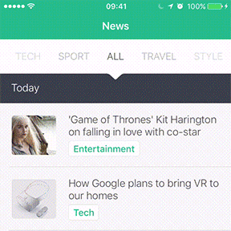
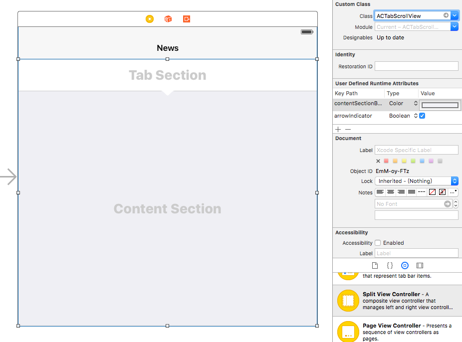

ACTabScrollView
===============

[](http://cocoapods.org/pods/ACTabScrollView)
[](http://cocoapods.org/pods/ACTabScrollView)
[](https://developer.apple.com/ios/)
[](https://developer.apple.com/swift/)
[](https://developer.apple.com/reference/objectivec)
[](https://github.com/azurechen/ACTabScrollView/blob/master/LICENSE.md)


A fancy `Menu` and `Pager` UI extends `UIScrollView` with elegant, smooth and synchronized scrolling `tabs`.

DEMO
----




User can interact with the UI by some different gestures. The `tabs` and `pages` will always scroll `synchronously`.

* `Swipe` pages normally
* `Drag` tabs can quickly move pages
* `Click` a tab to change to that page

You can also use `changePageToIndex` method to scroll pages programmatically.

Usage
-----

### Add an Object of `ACTabScrollView`

Drag a `UIView` object  onto the Interface Builder and set the `Class` to extends `ACTabScrollView ` in `XIB` or `Storyboard`.



You can also set properties at `Interface Builder`.

And remember to declare the `IBOutlet`.

```swift
@IBOutlet weak var tabScrollView: ACTabScrollView!
```

### Set Properties

All the following properties are `optional`. It provides more flexibility to customize. But it will be fine if you don't change any property.

```swift
override func viewDidLoad() {
    super.viewDidLoad()
    
    // all the following properties are optional
    tabScrollView.defaultPage = 3
    tabScrollView.arrowIndicator = true
    tabScrollView.tabSectionHeight = 40
    tabScrollView.tabSectionBackgroundColor = UIColor.whiteColor()
    tabScrollView.contentSectionBackgroundColor = UIColor.whiteColor()
    tabScrollView.tabGradient = true
    tabScrollView.pagingEnabled = true
    tabScrollView.cachedPageLimit = 3
    
    ...
}
```

### Delegate and DataSource

Set `Delegate` and `DataSource` first in `viewDidLoad()`, the usage is similar to `UITableView`.

```swift
override func viewDidLoad() {
    ...
    
    tabScrollView.delegate = self
    tabScrollView.dataSource = self
    
    ...
}
```

Prepare all the content views in `viewDidLoad()` may be a good idea. We had better not create the content view at each page change because it may cause performance issues.

```swift
override func viewDidLoad() {
    ...
    
	// create content views from storyboard
	let storyboard = UIStoryboard(name: "Main", bundle: NSBundle.mainBundle())
	for i in 0 ..< /* number of pages */ {
	    let vc = storyboard.instantiateViewControllerWithIdentifier("ContentViewController") as! ContentViewController
	    
	    /* set somethings for vc */
	    
	    addChildViewController(vc) // don't forget, it's very important
	    contentViews.append(vc.view)
	}
	
	...
}
```

And implement methods

```swift
// MARK: ACTabScrollViewDelegate
func tabScrollView(tabScrollView: ACTabScrollView, didChangePageTo index: Int) {
    print(index)
}
    
func tabScrollView(tabScrollView: ACTabScrollView, didScrollPageTo index: Int) {
}
    
// MARK: ACTabScrollViewDataSource
func numberOfPagesInTabScrollView(tabScrollView: ACTabScrollView) -> Int {
    return /* number of pages */
}
    
func tabScrollView(tabScrollView: ACTabScrollView, tabViewForPageAtIndex index: Int) -> UIView {
    // create a label
    let label = UILabel()
    label.text = /* tab title at {index} */
    label.textAlignment = .Center
    
    // if the size of your tab is not fixed, you can adjust the size by the following way.
    label.sizeToFit() // resize the label to the size of content
    label.frame.size = CGSize(
        width: label.frame.size.width + 28, 
        height: label.frame.size.height + 36) // add some paddings
    
    return label
}
    
func tabScrollView(tabScrollView: ACTabScrollView, contentViewForPageAtIndex index: Int) -> UIView {
    return contentViews[index]
}
```

The usage tutorial is finished, you can see more details and example at `ACTabScrollView/NewsViewController.swift`

### Using `ACTabScrollView` in `Objective-C` Project

It is very very easy if you use the newest version of Xcode.

First, import the automatically generated header `ACTabScrollView-Swift.h` in your `.m` file.

```objective-c
#import "ACTabScrollView-Swift.h"
```

This header is generated automatically, you don't need to change any setting.

And try to use `ACTabScrollView` in your `ViewController.m`

```objective-c
#import "ViewController.h"
#import "ACTabScrollView-Swift.h"

@interface ViewController ()
@end

@implementation ViewController

- (void)viewDidLoad {
    [super viewDidLoad];
    
    ACTabScrollView *tabScrollView = [[ACTabScrollView alloc] init];
    
    tabScrollView.defaultPage = 3;
    tabScrollView.arrowIndicator = true;
}

@end
```

Enjoy `ACTabScrollView` in your Objective-C project. 🎉

How to Install
--------------

### CocoaPods

If you didn't use [CocoaPods](http://cocoapods.org) before, install it first.

```bash
$ gem install cocoapods
$ pod setup
```

Create a file named `Podfile` in your project folder if this file doesn't exist. And append the following line into your `Podfile`.

```bash
pod 'ACTabScrollView', :git => 'https://github.com/azurechen/ACTabScrollView.git'
```

Then, run this command. 🎉

```bash
$ pod install
```

### Manual

Drag these two files into your project.

* `Sources/ACTabScrollView.swift`
* `Sources/ACTabScrollView+Protocol.swift`

And you can use `ACTabScrollView`. 🎉

Inspiration
-----------

The [Stackoverflow Question](http://stackoverflow.com/questions/26831662/creation-of-a-horizontal-infinite-scrolling-menu-bar-in-ios) inspired me to create this repo. Although `ACTabScrollView` does not implement all the features it mentions, such as `Infinite Scrolling`, I will keep to implement that. But the idea give me a motivation to do something, and brought `ACTabScrollView` here.

I use the UI from that question as examples in this project, because that is the best sample to show this concept, and only as an example. I always want to know what the app is but I still don't figure out.

If you create the app and you don't like me to use it as an example. Contact me and I will immediately remove that. Or I can mention you and your work at README and example files. Thank you very much!

License
-------

The MIT License (MIT)

Copyright (c) 2016 Azure Chen

Permission is hereby granted, free of charge, to any person obtaining a copy of this software and associated documentation files (the "Software"), to deal in the Software without restriction, including without limitation the rights to use, copy, modify, merge, publish, distribute, sublicense, and/or sell copies of the Software, and to permit persons to whom the Software is furnished to do so, subject to the following conditions:

The above copyright notice and this permission notice shall be included in all copies or substantial portions of the Software.

THE SOFTWARE IS PROVIDED "AS IS", WITHOUT WARRANTY OF ANY KIND, EXPRESS OR IMPLIED, INCLUDING BUT NOT LIMITED TO THE WARRANTIES OF MERCHANTABILITY, FITNESS FOR A PARTICULAR PURPOSE AND NONINFRINGEMENT. IN NO EVENT SHALL THE AUTHORS OR COPYRIGHT HOLDERS BE LIABLE FOR ANY CLAIM, DAMAGES OR OTHER LIABILITY, WHETHER IN AN ACTION OF CONTRACT, TORT OR OTHERWISE, ARISING FROM, OUT OF OR IN CONNECTION WITH THE SOFTWARE OR THE USE OR OTHER DEALINGS IN THE SOFTWARE.
